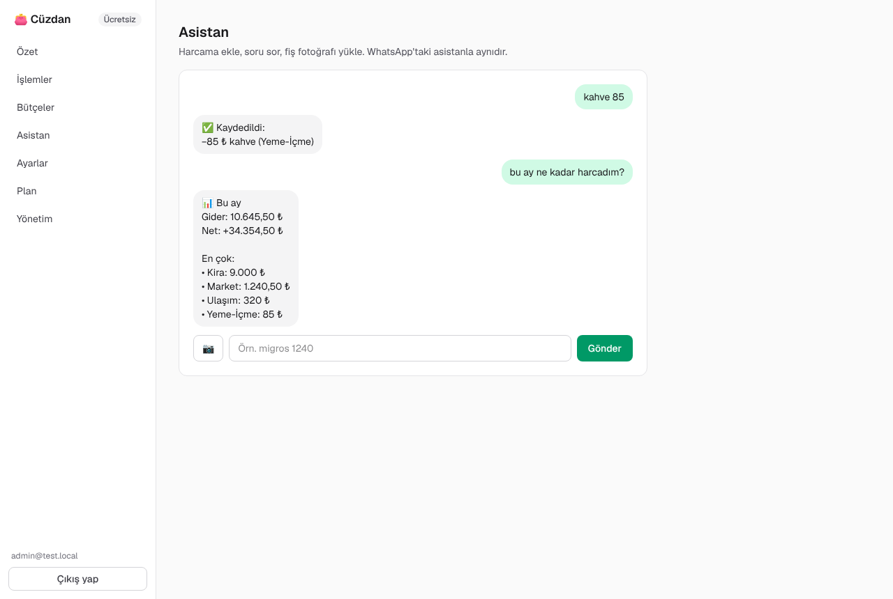
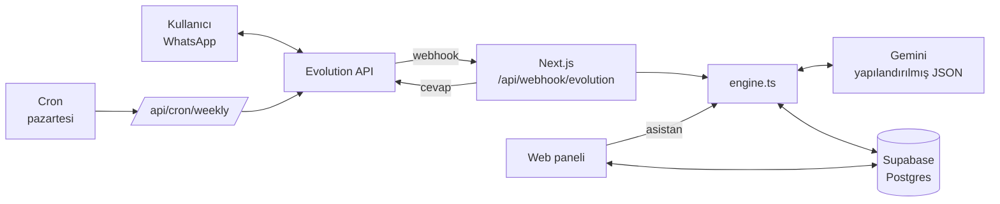

# 👛 Cüzdan — WhatsApp'tan yapay zekâ ile para yönetimi

Kullanıcıların harcama ve gelirlerini **WhatsApp'tan yazarak, fiş fotoğrafı çekerek ya da sesli mesajla** kaydettiği, yapay zekânın bunları kategorize edip bütçe uyarısı verdiği ve web panelinde raporladığı çok kullanıcılı bir SaaS ürünü. Ücretsiz + Pro abonelik modeliyle satılmaya hazır.

> Fikir: İsa Nurdoğdu'nun "Yapay Zeka ile Paramı Böyle Yönetiyorum" videosundaki kişisel sistemin herkesin kayıt olup kullanabileceği bir ürüne dönüştürülmüş hâli.

| Tanıtım sayfası | Panel |
|---|---|
|  |  |

| Asistan | Mobil |
|---|---|
|  |  |

Görüntülerdeki veriler örnektir.

## Ne yapar?

**WhatsApp'ta (kullanıcı tarafı)**
- `kahve 85`, `dün taksi 320`, `maaş yattı 45000 migros 900` → kalemler ayrıştırılır, kategorize edilir, kaydedilir.
- Fiş fotoğrafı → toplam, mağaza ve tarih okunur (Pro).
- Sesli mesaj → anlaşılır ve kaydedilir (Pro).
- `bu ay ne kadar harcadım?`, `markete ne verdim?` → rakamlar veritabanından hesaplanır (model uydurmaz).
- `markete aylık 5000 bütçe koy` → bütçe; %80'de ve aşımda otomatik uyarı.
- `geri al` → son kayıt silinir.
- Her pazartesi haftalık özet ve önceki haftayla karşılaştırma (Pro).

**Web panelinde**
- Kayıt / giriş (e-posta + şifre), WhatsApp'ı 6 haneli kodla bağlama.
- Özet: gelir, gider, net, günlük grafik, kategori dağılımı, bütçe durumu.
- İşlemler: aylara göre liste, elle ekleme/silme, CSV dışa aktarma (Pro, Excel uyumlu).
- Bütçeler, web'den asistanla yazışma ve fiş yükleme.
- Plan sayfası (kullanım, Pro'ya geçiş), hesap silme (KVKK).
- **Yönetim:** kullanıcı/Pro/dönüşüm sayıları, kullanıcıya Pro tanımlama, bot numarasının QR ile bağlanması.

## İş modeli

| | Ücretsiz | Pro (varsayılan 79 ₺/ay) |
|---|---|---|
| İşlem | Ayda 60 | Sınırsız |
| WhatsApp'tan yazarak kayıt | ✓ | ✓ |
| Fiş fotoğrafı, sesli mesaj | — | ✓ |
| Bütçe | 3 kategori | Sınırsız |
| Haftalık rapor, CSV | — | ✓ |

Sınırlar `lib/plans.ts` içinde, fiyat `NEXT_PUBLIC_PRO_PRICE` ile değiştirilir.

**Ödeme:** İlk sürüm, Türkiye'de şirket kurmadan da açılabilen **ödeme bağlantısı** modeliyle çalışır: `CHECKOUT_URL`'e iyzico / Shopier / PayTR / Stripe ödeme linkinizi yazın; kullanıcı e-postasıyla öder, siz Yönetim sayfasından tek tıkla "+1 ay Pro" / "+1 yıl Pro" tanımlarsınız. Satış hacmi artınca ödeme sağlayıcısının webhook'u `setPlan` mantığına bağlanarak otomatikleştirilebilir (yol haritasında).

**Birim maliyet (yaklaşık):** Bir mesaj tek bir Gemini Flash çağrısıdır; ayda 300 mesaj atan bir kullanıcının yapay zekâ maliyeti birkaç kuruş–birkaç lira düzeyindedir. Asıl sabit giderler sunucu ve WhatsApp bağlantısıdır.

## Mimari



Bir mesajın yolu:
1. Webhook gizli anahtarı doğrular; grup, kendi mesajlarımız ve desteklenmeyen türler elenir.
2. Mesaj kimliği benzersizdir; Evolution aynı mesajı tekrar yollarsa ikinci kez işlenmez.
3. Numara kayıtlı değilse: mesajda geçerli bağlantı kodu varsa hesap bağlanır, yoksa kayıt bağlantısı gönderilir.
4. Görsel/ses varsa Evolution'dan indirilir (Pro kontrolü bundan önce yapılır, ücretsiz kullanıcı için modele gidilmez).
5. Gemini'ye bu ayın özeti, bütçeler ve son 6 mesajla birlikte gönderilir; model **yalnızca şemaya uyan JSON** döndürür (niyet + kalemler).
6. Çıktı `sanitize` ile doğrulanır: negatif/aşırı tutarlar atılır, bilinmeyen kategori "Diğer"e iner, gelecekteki tarih bugüne çekilir.
7. Kayıt, sorgu, bütçe ve geri alma işlemleri kodla yapılır; rakamlar her zaman veritabanından hesaplanır.

## Teknolojiler

Next.js 16 (App Router, Server Actions, Proxy), React 19, TypeScript, Tailwind CSS 4, Supabase (Postgres), Google Gemini (`@google/genai`), Evolution API.

## Proje yapısı

```
app/
  page.tsx              Tanıtım + fiyat sayfası
  signup, login, legal  Kayıt, giriş, kullanım koşulları/KVKK taslağı
  app/                  Oturum gerektiren panel: özet, işlemler, bütçeler, asistan, ayarlar, plan, yönetim
  api/webhook/evolution WhatsApp mesajlarının giriş noktası
  api/cron/weekly       Haftalık özet gönderimi
  api/export            CSV dışa aktarma
  actions.ts            Server Actions
lib/
  engine.ts             Mesaj işleme: kayıt, sorgu, bütçe, geri alma, plan sınırları
  ai.ts                 Gemini çağrısı, JSON şeması, çıktı doğrulama
  whatsapp.ts           WhatsApp akışı, hesap bağlama
  stats.ts, digest.ts   Özetler ve haftalık rapor
  auth.ts               Şifre (scrypt), imzalı oturum çerezi, yönetici kontrolü
  plans.ts, categories.ts, dates.ts, format.ts, db.ts, evolution.ts
proxy.ts                /app ve /api/export için oturum kontrolü
supabase/schema.sql     Veritabanı şeması
scripts/e2e-test.mjs    Uçtan uca test
```

## Kurulum

1. `npm install`
2. **Supabase:** Proje açın, SQL Editor'de [supabase/schema.sql](supabase/schema.sql) dosyasını çalıştırın.
3. **Gemini:** [Google AI Studio](https://aistudio.google.com/apikey)'dan anahtar alın.
4. **Ortam değişkenleri:** `.env.example` → `.env.local`, doldurun. `ADMIN_EMAILS`'e kendi e-postanızı yazın.
5. `npm run dev` → http://localhost:3000, kayıt olun.
6. **WhatsApp:** Bot için ayrı bir numara kullanın. Evolution API'yi çalıştırın (`docker compose -f evolution/docker-compose.yml up -d` ya da Railway), panelde **Yönetim** sayfasında QR'ı okutun ve "Webhook'u kaydet"e basın. `NEXT_PUBLIC_BOT_NUMBER`'a numarayı yazın.
7. **Haftalık rapor:** Vercel'de `vercel.json` cron'u otomatik çalışır (pazartesi 09:00 TR). Başka sunucuda `GET /api/cron/weekly`'yi `Authorization: Bearer $CRON_SECRET` ile haftada bir çağırın.

**Yayına alma:** Panel Vercel/Railway'e, Evolution API Railway/VPS'e. `APP_URL`'i gerçek alan adına çevirin.

## Test

```bash
npm run test:e2e
```

Uygulamayı kendisi başlatır; Supabase gerçek, Evolution API ve Gemini sahte sunucularla taklit edilir. 28 durum sınanır: webhook kimlik doğrulama, kayıtsız numara ve kodla hesap bağlama, tekrarlanan mesaj, tek mesajda çok kalem, bütçe ve %80 uyarısı, aylık ve kategori sorguları, geçersiz model çıktısının ayıklanması, ücretsiz/Pro fiş akışı, geri alma, grup mesajları, haftalık özet ve cron yetkisi, ücretsiz plan sınırı, panel yönlendirmesi. Test bittiğinde kendi verisini siler.

Kayıt → WhatsApp kodu → elle işlem ekleme → bütçe → asistan → özet → yönetim akışı ayrıca tarayıcıda (Playwright) masaüstü ve mobil genişlikte denenmiştir.

**Sınanmamış olan:** Modelin gerçek Türkçe mesajları, fişleri ve sesleri ne kadar doğru anladığı gerçek `GEMINI_API_KEY` ile denenmelidir; gerçek WhatsApp numarasıyla bağlantı da henüz denenmedi.

## Güvenlik ve KVKK

- Şifreler scrypt ile tuzlanarak saklanır; oturum çerezi `httpOnly`, HMAC imzalı ve süreli.
- Her server action ve sayfa oturumu sunucuda yeniden doğrular; tüm sorgular `user_id` ile sınırlıdır.
- Veritabanına yalnızca sunucudan gizli anahtarla erişilir; RLS açık, herkese açık anahtara politika yok.
- Webhook ve cron sabit süreli karşılaştırmayla gizli anahtar ister.
- CSV'de formül enjeksiyonu engellenir.
- Fiş görselleri ve sesler saklanmaz; yalnızca çıkarılan kayıt tutulur. Hesap silinince tüm veri silinir.
- `/legal` sayfası **taslaktır**; yayından önce bir hukukçuya kontrol ettirin.

## Bilinen sınırlar

- Evolution API resmi WhatsApp ürünü değildir; ölçek büyüyünce numara kapatılma riskine karşı resmi **WhatsApp Business Cloud API**'ye geçilmelidir (`lib/evolution.ts` tek değişecek dosya).
- Pro aktivasyonu şimdilik elle (Yönetim sayfası).
- Tüm tutarlar kullanıcının seçtiği tek para biriminde tutulur; kur çevirisi yok.
- Şifre sıfırlama e-postası yok (e-posta servisi gerekiyor).

## Yol haritası

- iyzico/Stripe webhook'u ile otomatik abonelik
- Şifre sıfırlama ve e-posta doğrulama
- Banka ekstresi (PDF/CSV) yükleyip toplu içe aktarma
- Tekrarlayan ödemeler (kira, abonelik) ve hatırlatmalar
- Aile/ortak cüzdan (birden çok kişi tek bütçe)
- Birikim hedefleri
