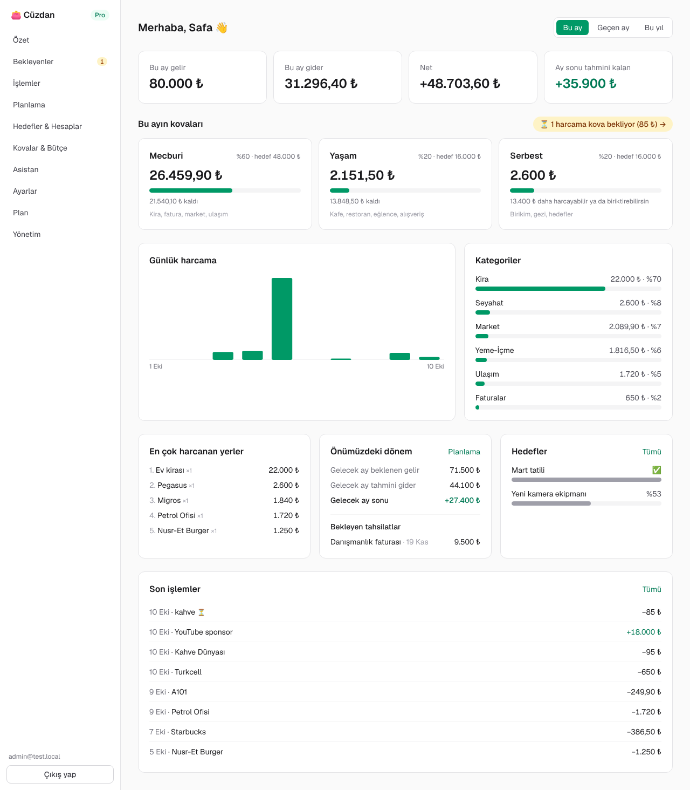
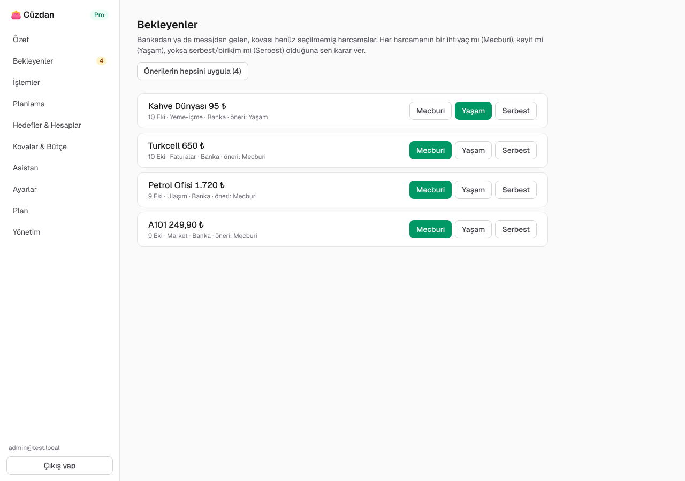
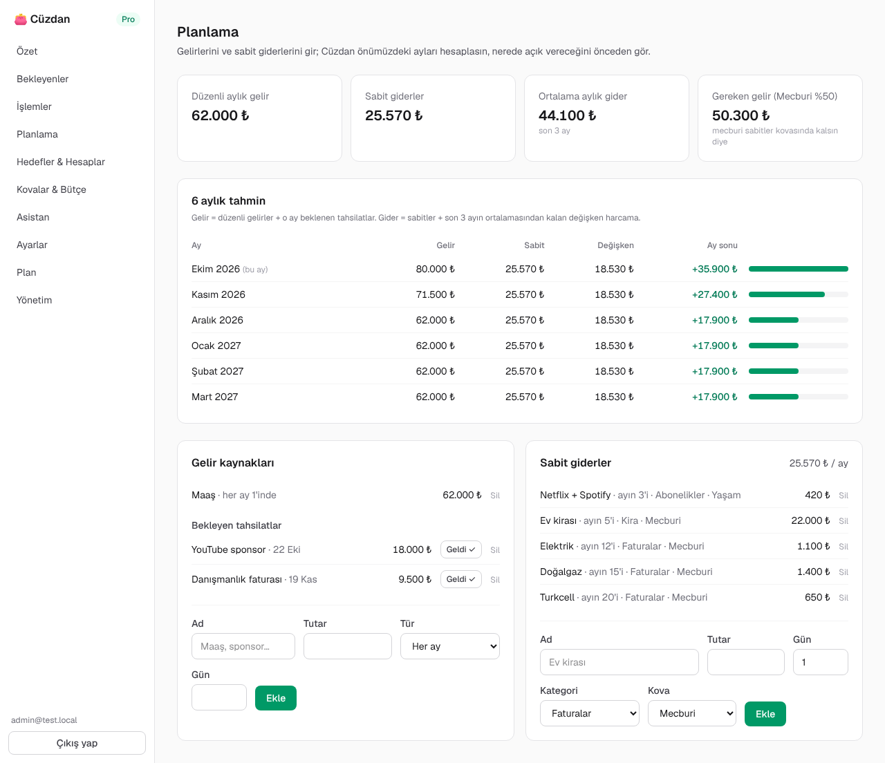
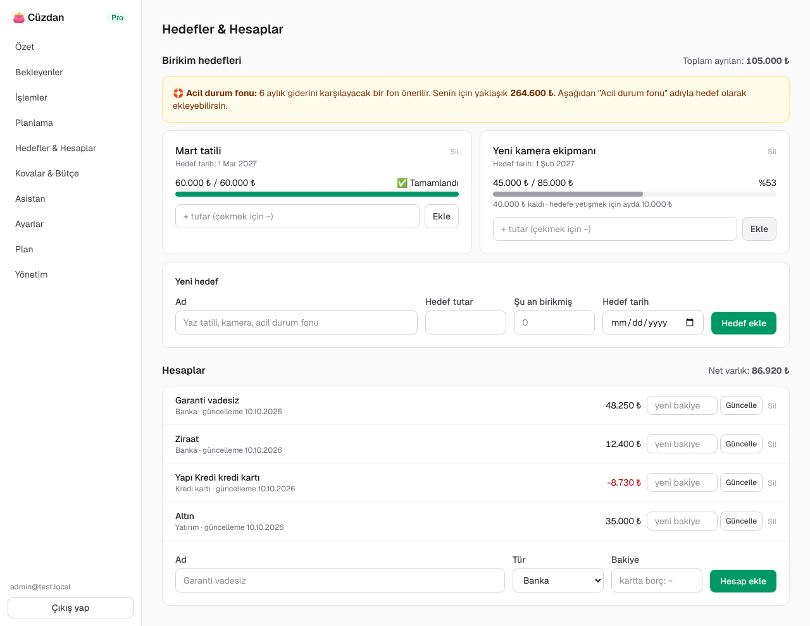
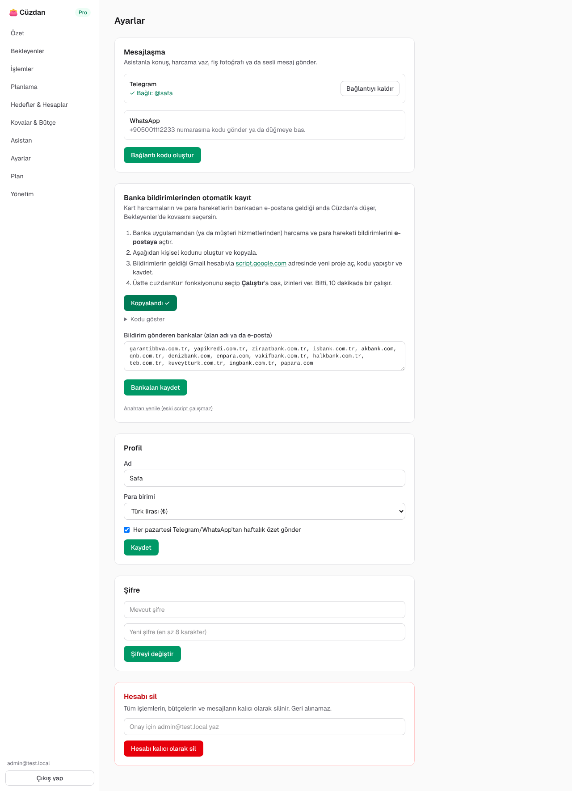
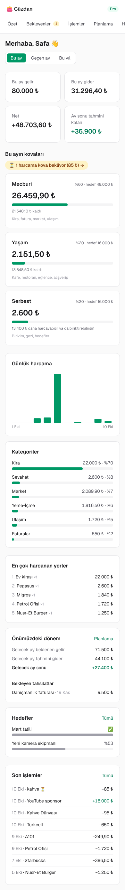
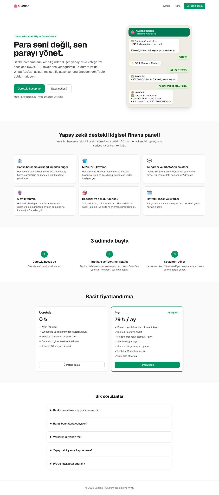
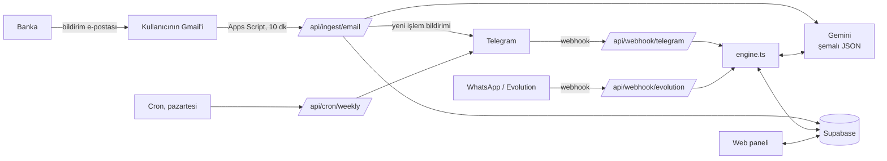

# 👛 Cüzdan — yapay zekâ destekli kişisel finans paneli

Banka harcamalarının **kendiliğinden düştüğü**, yapay zekânın kategorize ettiği, kullanıcının harcamaları **50/30/20 kovalarına** (Mecburi / Yaşam / Serbest) yerleştirdiği; gelir, sabit gider, hedef ve hesaplarla **önümüzdeki ayları tahmin eden** ve **Telegram / WhatsApp asistanıyla** konuşulan, çok kullanıcılı bir SaaS. Ücretsiz + Pro abonelik modeliyle satılmaya hazır.

> **Kaynak:** İsa Nurdoğdu'nun ["Yapay Zeka ile Paramı Böyle Yönetiyorum"](https://youtu.be/cGtcNSB6BfQ) videosundaki kişisel finans paneli. Videoda kişi kendi paneli için Supabase + Gmail Apps Script + Vercel + Telegram/Gemini kuruyor; Cüzdan aynı sistemi **herkesin kayıt olup birkaç dakikada kullanabileceği** bir ürüne dönüştürür: kod yazmak, Supabase hesabı açmak, MCP kurmak gerekmez.

| Özet | Bekleyenler |
|---|---|
|  |  |

| Planlama ve 6 aylık tahmin | Hedefler ve hesaplar |
|---|---|
|  |  |

| Ayarlar (Telegram, banka e-postası) | Mobil | Tanıtım sayfası |
|---|---|---|
|  |  |  |

Görüntülerdeki veriler örnektir.

## Videodaki sistem → Cüzdan

| Videoda | Cüzdan'da |
|---|---|
| Banka bildirimlerini e-postaya açtırma, Claude'un yazdığı Apps Script ile Gmail'den okuma | Ayarlar'da **kişisel anahtarla hazır Apps Script**: kopyala, script.google.com'a yapıştır, `cuzdanKur`'u çalıştır. Banka biçiminden bağımsız olarak Gemini tutarı, işyerini, tarihi okur; reklam/OTP e-postalarını atlar. |
| İşlemlerin "bekleyenler"e düşmesi, kullanıcının mecburi/yaşam/serbest seçmesi | **Bekleyenler** sayfası: önerilen kova vurgulu, tek tıkla ya da "önerilerin hepsini uygula". Telegram'dan "mecburi" yazmak da yeter. |
| 50/30/20 kovaları | Kova kartları (hedef = gelir × oran, harcanan, kalan), oranlar ayarlanabilir (60/20/20 vb.). |
| Gelir kaynakları, bekleyen tahsilatlar (sponsorlar) | Düzenli gelirler + bir kerelik tahsilatlar, "Geldi ✓" ile gelire dönüşür. |
| Sabitler (kira, abonelik, elektrik, doğalgaz) | Sabit giderler; **gereken gelir** (mecburi sabitler %50'yi aşmasın diye) hesaplanır. |
| "Ay sonunda ne kalır, önümüzdeki 6 ay nereye gidiyor" | **6 aylık tahmin**: gelir + beklenen tahsilat − sabitler − son 3 ayın değişken ortalaması. |
| Hedefler (Mart tatili, kamera), acil durum fonu | Hedef kartları, aylık ne ayırman gerektiği, **6 aylık gider kadar acil durum fonu önerisi**. |
| Hesaplar ve bakiyeler | Hesaplar (banka, nakit, kredi kartı borcu, yatırım) ve net varlık. |
| En çok harcanan iş yerleri, grafikler | Özet sayfasında günlük grafik, kategoriler, en çok harcanan yerler. |
| Telegram botu + Gemini: "bu ay markete ne kadar harcadım", fiş fotoğrafı, "hedeflerime ne kadar kaldı", "önerilerin var mı" | Telegram (ve WhatsApp) asistanı: aynı sorular, fiş, sesli mesaj, kova atama, tahmin, öneri. Tek bot tüm kullanıcılara hizmet eder; hesap `t.me/bot?start=KOD` ile bağlanır. |
| Vercel'e deploy, şifreli giriş | Çok kullanıcılı giriş (scrypt), `vercel.json` cron'u, Vercel'e hazır. |
| `security review` | Aşağıdaki güvenlik bölümü ve uçtan uca testler. |

## İş modeli

| | Ücretsiz | Pro (varsayılan 79 ₺/ay) |
|---|---|---|
| İşlem | Ayda 60 | Sınırsız |
| Telegram / WhatsApp'tan yazarak kayıt, sorular | ✓ | ✓ |
| 50/30/20 kovaları, Bekleyenler, planlama, 6 aylık tahmin, hesaplar | ✓ | ✓ |
| **Banka e-postalarından otomatik kayıt** | — | ✓ |
| Fiş fotoğrafı, sesli mesaj | — | ✓ |
| Hedef / kategori bütçesi | 2 / 3 | Sınırsız |
| Haftalık rapor, CSV | — | ✓ |

Sınırlar `lib/plans.ts`'te, fiyat `PRO_PRICE` ile değişir. **Ödeme:** `CHECKOUT_URL`'e iyzico / Shopier / PayTR / Stripe ödeme linki yazılır; kullanıcı e-postasıyla öder, Pro'yu Yönetim sayfasından tek tıkla ("+1 ay", "+1 yıl") tanımlarsınız. Ödeme sağlayıcısının webhook'uyla otomatikleştirmek yol haritasında.

**Birim maliyet:** Bir mesaj ya da banka e-postası tek bir Gemini Flash çağrısıdır; ayda ~300 işlem yapan bir kullanıcının yapay zekâ maliyeti birkaç lirayı geçmez. Aynı e-posta ikinci kez modele gönderilmez.

## Mimari



- **Banka e-postası:** Script `Authorization: Bearer <kişisel anahtar>` ile en fazla 20 e-posta gönderir. Her e-posta `ingested_emails`'e yazılır, bir daha modele gitmez. İşlem olanlar kovası boş (Bekleyenler), önerilen kovayla kaydedilir; kullanıcıya Telegram/WhatsApp'tan "💳 Bankadan 2 yeni işlem… kovası için mecburi/yaşam/serbest yaz" bildirimi gider. İşlenemeyen e-postalar `failedIds` ile döner; script bir sonraki çalışmada onlardan devam eder.
- **Mesajlar:** Kanal fark etmeksizin aynı akış (`lib/channels.ts` → `lib/engine.ts`). Model yalnızca niyeti ve kalemleri çıkarır; **tüm rakamlar (sorgular, kovalar, hedefler, tahmin) veritabanından kodla hesaplanır**, model uydurmaz. Model çıktısı `sanitize` ile doğrulanır.
- **Bağlantı:** Kullanıcı panelde 6 haneli kod alır; Telegram'da `t.me/<bot>?start=KOD`, WhatsApp'ta "Bağla KOD".

## Teknolojiler

Next.js 16 (App Router, Server Actions, Proxy), React 19, TypeScript, Tailwind CSS 4, Supabase (Postgres), Google Gemini (`@google/genai`), Telegram Bot API, Evolution API (WhatsApp), Google Apps Script.

## Proje yapısı

```
app/
  page.tsx                Tanıtım + fiyat sayfası
  signup, login, legal    Kayıt, giriş, kullanım koşulları/KVKK taslağı
  app/                    Panel: özet, bekleyenler, işlemler, planlama, hedefler & hesaplar,
                          kovalar & bütçe, asistan, ayarlar, plan, yönetim
  api/ingest/email        Gmail script'inden gelen banka e-postaları
  api/webhook/telegram    Telegram botu
  api/webhook/evolution   WhatsApp
  api/cron/weekly         Haftalık özet
  api/export              CSV
  actions.ts              Server Actions
lib/
  engine.ts               Mesaj işleme: kayıt, sorgu, kova, hedef, tahmin, bütçe, geri alma
  ai.ts                   Gemini: mesaj ve banka e-postası ayrıştırma, JSON şemaları, doğrulama
  ingest.ts               Banka e-postası alımı
  appsScript.ts           Kullanıcıya özel Google Apps Script üretimi
  channels.ts             Telegram/WhatsApp ortak akışı, hesap bağlama, bildirim
  planning.ts             Kovalar, 6 aylık tahmin, gereken gelir, acil durum fonu
  telegram.ts, evolution.ts, stats.ts, digest.ts, auth.ts, plans.ts, categories.ts, dates.ts, format.ts, db.ts
supabase/schema.sql       Veritabanı şeması
scripts/e2e-test.mjs      Uçtan uca test
```

## Kurulum

1. `npm install`
2. **Supabase:** Proje açın (bölge: Frankfurt), SQL Editor'de [supabase/schema.sql](supabase/schema.sql)'i çalıştırın; proje URL'sini ve `service_role` anahtarını alın.
3. **Gemini:** [Google AI Studio](https://aistudio.google.com/apikey)'dan anahtar alın.
4. **Telegram:** @BotFather → `/newbot`, anahtarı alın.
5. `.env.example` → `.env.local` ve doldurun; `ADMIN_EMAILS`'e kendi e-postanızı yazın.
6. **Yayın:** Vercel'e deploy edin (`vercel.json` haftalık cron'u içerir), `APP_URL`'i gerçek adrese çevirin.
7. Kayıt olun → **Yönetim** → "Telegram webhook'unu kaydet". (İsteğe bağlı WhatsApp: Evolution API'yi çalıştırıp aynı sayfadan QR'ı okutun.)
8. Kendi hesabınıza Pro verin, **Ayarlar → Banka bildirimlerinden otomatik kayıt** adımlarını izleyin.

Yerelde: `npm run dev` → http://localhost:3000.

## Test

```bash
npm run test:e2e
```

Uygulamayı kendisi başlatır. Supabase gerçek, Evolution API, Telegram ve Gemini sahte sunucularla taklit edilir. **47 durum** sınanır, örneğin:
- Webhook ve cron kimlik doğrulaması; WhatsApp ve Telegram'da kodla hesap bağlama.
- Tekrarlanan mesajlar; tek mesajda birden çok kalem; modelin kovası ve kovasız harcamanın Bekleyenler'e düşmesi.
- Sohbetle kova atama; bütçe uyarısı; aylık, kategori, hedef ve tahmin soruları; geçersiz model çıktısının ayıklanması.
- Ücretsiz ve Pro fiş akışı (WhatsApp ve Telegram); geri alma; grup mesajları; haftalık özet.
- **Banka e-postası:** anahtar ve plan kontrolü, reklamın atlanması, kova önerisi, Telegram bildirimi, tekrar gelen e-postanın işlenmemesi, hatalı e-postanın yeniden deneme listesi, parti sınırı.
- Ücretsiz plan sınırı.

Kayıt → bekleyenleri kovaya atma → tahsilatı "geldi" yapma → sabit gider ekleme → hedefe para ekleme → oranları değiştirme → Apps Script'i kopyalama → asistan akışı ayrıca Playwright ile masaüstü ve mobilde denendi.

**Sınanmamış olan:** Gerçek Gemini'nin gerçek banka e-postalarını, Türkçe mesajları, fişleri ve sesleri ne kadar doğru okuduğu, gerçek bir Gmail'de Apps Script'in çalışması ve gerçek Telegram/WhatsApp bağlantısı; bunlar gerçek anahtarlarla denenmeli.

## Güvenlik ve KVKK

- Banka şifresi ya da internet bankacılığı erişimi **istenmez**; yalnızca kullanıcının kendi Gmail'inde, kendi izniyle çalışan script bildirim e-postalarını gönderir. Script kullanıcıya özel 48 haneli anahtarla çalışır, panelden yenilenebilir.
- Şifreler scrypt ile saklanır; oturum çerezi `httpOnly`, HMAC imzalı ve süreli. Her sorgu `user_id` ile sınırlıdır.
- Veritabanına yalnızca sunucudan erişilir; RLS açık, herkese açık anahtara politika yok.
- Webhook'lar (Telegram secret token, Evolution başlığı) ve cron sabit süreli karşılaştırmayla doğrulanır.
- E-posta metinleri, fiş görselleri ve sesler saklanmaz; yalnızca çıkarılan işlem tutulur. Hesap silinince tüm veri silinir.
- `/legal` sayfası **taslaktır**; yayından önce bir hukukçuya kontrol ettirin.

## Bilinen sınırlar

- Pro aktivasyonu şimdilik elle (Yönetim sayfası).
- Banka e-postası için kullanıcının Gmail kullanması gerekir (Outlook vb. için yönlendirme kuralı + ileride gelen kutusu adresi).
- Tek para birimi; yabancı para harcamaları açıklamada işaretlenir, kur çevrilmez.
- Şifre sıfırlama e-postası yok. WhatsApp için Evolution API resmi değildir (Telegram önerilir; ölçekte WhatsApp Business Cloud API).

## Yol haritası

- iyzico/Stripe webhook'u ile otomatik abonelik
- Gelen kutusu adresi (`kullanici@gelen.cuzdan.app`) ile Gmail dışı e-postalar
- Sabit giderlerin banka kayıtlarıyla eşleştirilip "ödendi" işaretlenmesi
- Aile/ortak cüzdan, şifre sıfırlama
