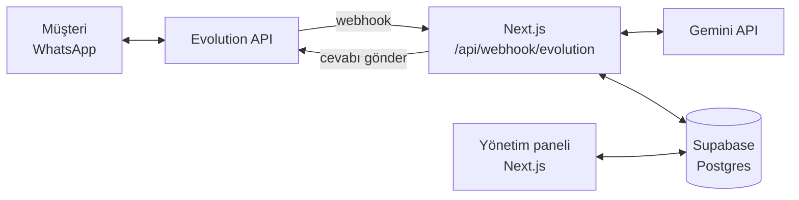

# WhatsApp AI Asistanı + CRM Paneli

WhatsApp'tan yazan müşterilere yapay zekâ ile otomatik cevap veren, konuşmaları ve müşteri adaylarını tek bir web panelinde toplayan sistem. Bot cevabını bilmediği ya da müşterinin insan istediği durumlarda konuşmayı işletme sahibine devreder.

## Özellikler

- **Otomatik cevap:** Gelen mesaj, konuşma geçmişi ve işletme bilgileriyle birlikte Gemini'ye gönderilir; cevap WhatsApp'tan iletilir.
- **İnsana devir:** Anahtar kelime ("yetkili", "temsilci"…) ya da modelin kendi kararıyla konuşma devredilir, bot o kişide susar.
- **Gelen kutusu:** Tüm konuşmalar panelde; işletme sahibi panelden kendisi de yazabilir.
- **Kişi takibi (CRM):** Her yazan kişi otomatik kaydedilir; durum (yeni, görüşülüyor, kazanıldı…) ve not tutulur.
- **Panelden ayar:** İşletme bilgileri, üslup, devir kelimeleri ve model kod değiştirmeden güncellenir.
- **Deneme ekranı:** Botun cevapları WhatsApp'a göndermeden sınanır.
- **Deneme modu:** `TEST_NUMBERS` tanımlıyken bot yalnızca listedeki numaralarla ilgilenir; kişisel bir numarayla güvenle sınanabilir.
- **Dayanıklılık:** Model yoğunken yedek modele geçer; aynı mesaj iki kez gelirse ikinci kez işlenmez.

## Mimari



Bir mesajın izlediği yol:

1. Müşteri WhatsApp'tan yazar; Evolution API mesajı bu uygulamanın webhook adresine iletir.
2. Webhook gizli anahtarı doğrular, grup ve metin dışı mesajları eler.
3. Kişi ve mesaj Supabase'e kaydedilir. Mesaj kimliği benzersiz olduğu için tekrar gelen aynı mesaj atlanır.
4. Bot kapalıysa ya da o kişi insana devredilmişse işlem burada biter.
5. Son 20 mesaj ve işletme bilgileri Gemini'ye gönderilir.
6. Cevap Evolution üzerinden müşteriye iletilir ve kaydedilir; model devir işareti koyduysa konuşma devredilir.

## Teknolojiler

| Katman | Teknoloji |
|---|---|
| Arayüz ve sunucu | Next.js 16 (App Router, Server Actions), React 19, TypeScript |
| Stil | Tailwind CSS 4 |
| Veritabanı | Supabase (Postgres) |
| Yapay zekâ | Google Gemini API (`@google/genai`) |
| WhatsApp bağlantısı | Evolution API |

## Güvenlik

- Veritabanına yalnızca sunucudan, gizli anahtarla erişilir; anahtar tarayıcıya hiç gönderilmez.
- Tüm tablolarda satır düzeyi güvenlik (RLS) açıktır ve herkese açık anahtar için politika yoktur.
- Panel şifre korumalıdır; oturum çerezi `httpOnly` ve HMAC imzalıdır. Her sunucu işlemi oturumu ayrıca doğrular.
- Webhook, gizli anahtar taşımayan istekleri reddeder; karşılaştırmalar zamanlama saldırılarına karşı sabit sürelidir.
- Anahtarlar `.env.local` dosyasında tutulur ve depoya girmez.

## Proje yapısı

```
app/
  (panel)/            Oturum gerektiren sayfalar: özet, gelen kutusu, kişiler, ayarlar, deneme
  api/webhook/        Evolution'dan gelen mesajların giriş noktası
  login/              Giriş sayfası
  actions.ts          Server Actions (giriş, ayar kaydetme, mesaj gönderme…)
lib/
  bot.ts              Mesaj işleme akışı ve insana devir
  ai.ts               Gemini çağrısı, sistem talimatı, yedek model
  evolution.ts        Evolution API istemcisi
  db.ts               Supabase istemcisi ve tipler
  auth.ts             Oturum doğrulama
proxy.ts              Girişsiz istekleri giriş sayfasına yönlendirir
supabase/schema.sql   Veritabanı şeması
```

## Kurulum

1. **Bağımlılıklar**
   ```bash
   npm install
   ```
2. **Supabase:** Bir proje açın, SQL Editor'de [supabase/schema.sql](supabase/schema.sql) içeriğini çalıştırın. Proje URL'sini ve gizli (secret / service_role) anahtarı alın.
3. **Gemini:** [Google AI Studio](https://aistudio.google.com/apikey) üzerinden bir API anahtarı oluşturun.
4. **Evolution API:** Yerelde Docker ile çalıştırmak için `evolution/.env` dosyasına `EVOLUTION_API_KEY=<rastgele bir anahtar>` yazın ve başlatın:
   ```bash
   docker compose -f evolution/docker-compose.yml up -d
   ```
   Aynı anahtarı `.env.local` içindeki `EVOLUTION_API_KEY`'e, adresi (`http://localhost:8080`) `EVOLUTION_API_URL`'e yazın. QR kodu panelde **Bot Ayarları > WhatsApp bağlantısı** bölümünde görünür; WhatsApp > Bağlı Cihazlar ile okutun. (Alternatif: Evolution API'yi Railway gibi bir sunucuya deploy edin.)
5. **Ortam değişkenleri:** `.env.example` dosyasını `.env.local` adıyla kopyalayıp doldurun.
6. **Çalıştırma**
   ```bash
   npm run dev
   ```
   Panel: http://localhost:3000
7. **Webhook:** `APP_URL`'e Evolution'ın panele ulaşacağı adresi yazın (ikisi de yereldeyse `http://host.docker.internal:3000`; Evolution uzaktaysa panelin internetten erişilen adresi) ve panelde **Bot Ayarları > Webhook'u Evolution'a kaydet** düğmesine basın.

## Test

```bash
npm run test:webhook
```

[scripts/webhook-test.mjs](scripts/webhook-test.mjs), Evolution API'yi taklit eden sahte bir sunucu açar, uygulamaya sahte WhatsApp mesajları gönderir ve veritabanındaki sonucu doğrular. Supabase ve Gemini gerçektir; yalnızca WhatsApp'a gönderim taklit edilir. Sınanan durumlar:

- Gizli anahtarı olmayan ya da yanlış olan isteklerin reddedilmesi
- Kişinin ve mesajların kaydedilmesi, cevabın işletme bilgisine dayanması
- Tekrarlanan mesajın ve botun kendi mesajının yankısının çift işlenmemesi
- Grup ve metin dışı mesajların yok sayılması
- Anahtar kelimeyle ve modelin kararıyla insana devir, devirden sonra botun susması
- Bot kapalıyken mesajın kaydedilip cevap verilmemesi

Test, dev sunucusu kapalıyken çalıştırılmalıdır ve bittiğinde kendi verisini siler.

## Durum

Mesaj akışının tamamı yukarıdaki testle doğrulanmıştır. Gerçek bir WhatsApp numarasıyla canlı bağlantı (Evolution API kurulumu ve QR eşleştirme) henüz yapılmamıştır; bunun için gereken tek şey kurulumdaki 4. ve 7. adımlardır.

## Bilinen sınırlar

- Yalnızca metin mesajları işlenir; ses, görsel ve belge yok sayılır.
- Grup mesajlarına cevap verilmez.
- Evolution API resmi bir WhatsApp ürünü değildir; spam ya da şikâyet durumunda numara kapatılabilir. Ticari ölçekte resmi WhatsApp Business API tercih edilmelidir.

## Yol haritası

- Fiyat listesi gibi belgelerin yüklenip bota bağlam olarak verilmesi
- Cevap vermeyen kişilere 6. ve 24. saatte otomatik takip mesajı
- İnsana devirde Telegram bildirimi
- Çalışma saatleri ve mesai dışı mesajı
- Satış temsilcisi başına ayrı giriş ve kişi ataması
